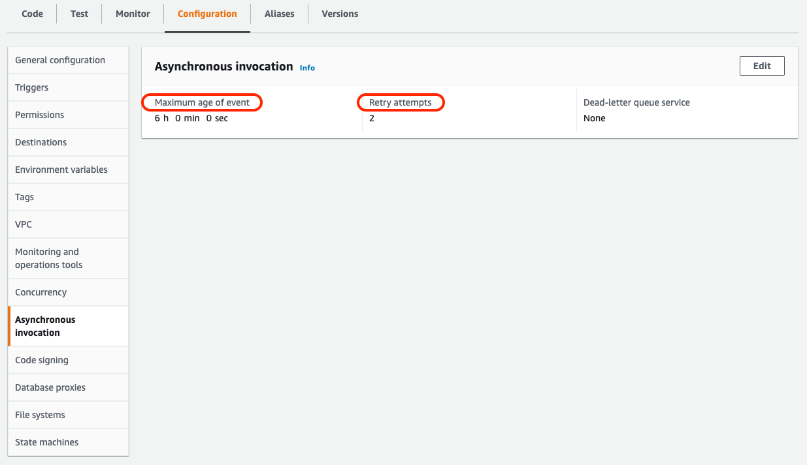

AWS Lambda가 구체적으로 어떻게 동작하는지 설명하는 글입니다.
AWS Lambda의 실행 환경을 이해한다면 구현하면서 마주치는 여러 문제를 좀 더 빠르게 파악하고 해결 할 수 있을 것입니다.

이 포스트의 내용은 아래 문서들을 참고해서 작성했습니다.  
[AWS Lambda 개발자 안내서](https://docs.aws.amazon.com/ko_kr/lambda/latest/dg/welcome.html)  


## 실행 환경

Lambda는 AWS가 직접 관리하는 안전하고 격리된 환경에서 함수를 호출합니다.
기본적으로 Lambda 함수가 호출될 때, 컨테이너가 실행되고 그 컨테이너 안에서 내가 구현한 `handler`가 실행됩니다.
하나의 `handler`가 실행을 마쳤을 때 컨데이터가 바로 종료되지는 않습니다. 
일정 시간 동안 대기하고 있다가 같은 Lambda 함수가 호출되면 다시 그 컨테이너 환경에서 `handler`가 실행되지만
일정 시간 동안 호출이 없으면 컨테이너는 종료됩니다.

구체적인 생명주기를 살펴보면 크게 3단계로 나뉩니다.
1. 초기화 단계 (INIT)
2. 호출 단계 (INVOKE)
3. 종료 단계 (SHUTDOWN)


### 초기화 단계 (INIT)
1. 실행 환경을 생성하거나 활성화
2. 리소스 설정
3. `handler` 함수와 계층(Layer)의 모든 코드 다운로드
4. 모든 익스텐션 초기화
5. 런타임 초기화
6. `handler` 함수 초기화

보통 1~3번의 과정을 `cold starts`라고 불리우며 이 단계는 비용 계산에 포함되지 않습니다.


### 호출 단계 (INVOKE)
`handler` 함수가 실행 됩니다. 익스텐션을 포함한 `handler` 함수는 설정된 제한 시간(기본 900초)안에 모두 실행 되야 합니다.   

위 그림은 정상적으로 함수가 호출되고 대기시간 안에 함수가 또 한 번 호출된 상황을 보여줍니다

실행 중 에러가 발생하거나 제한시간을 초과하면, 실행 환경을 다시 초기화 한 후에 다음 함수를 실행합니다.  
아래 그림은 에러 상황에서의 생명주기를 보여줍니다.


### 종료 단계 (SHUTDOWN)
호출 단계가 끝났다고 해서 Lambda는 곧바로 종료되지 않고 다음 함수 호출을 예상하여 일정 시간 동안 초기화된 환경을 유지합니다. 
이렇게 환경이 유지된 상태에서 함수가 호출되는 상황을 흔히 `warm starts`라고 합니다. 
이때는 초기화 단계가 모두 생략되기 때문에 상대적으로 빠른 응답 속도를 보입니다.

`warm starts` 상태에서 유의해야 할 점이 있는데 `handler` 함수 스코프 밖에 선언된 객체들은 다음 함수 호출 시에도 유지될 수 있다는 것입니다.
```javascript
let cachedUserMap = new HashMap();
const getUserData = async (userId) => {
    let user = cachedUserMap.get(userId);
    if (!user) {
        user = await getUserFromDb(userId);
    }
    return user; // 이 `user`는 함수가 실행 될 때, 언제나 최신 데이터라는 점이 보장 되지 않음 
}
const foo = async (userId) => {
    const user = await getUserData();
    // ... doing sth
}
const updateUser = async (userId) => {
    const user = await getUserData();
    const updatedUser = { 
        ...user, 
        // something updated properties 
    }
    await updateUser(userId, updatedUser);
}
module.exports.handler = async (event) => {
    await foo(event.userId);
    await updateUser(event.userId);
    // ...
}
```
위 함수에서 `cachedUserMap`에 있는 user 정보들은 상황에 따라 업데이트되지 않은 캐시 된 user 데이터를 반환할 가능성이 있다는 걸 염두 해야 합니다.
위 함수가 cold starts 상황이라면 새로운 user 데이터를 DB에서 받아 오겠지만,
warm starts 상황이라면 이전 함수 호출 때 DB에서 불러온 데이터가 그대로 남아 있어서 업데이트되지 않은 값을 반환하게 됩니다. 

### 오류 처리
함수 실행 중 오류가 발생하면 AWS Lambda는 이벤트 큐에 오류를 쌓고 설정된 값에 따라 재실행 하게 됩니다.
별다른 설정을 하지 않은 상태에서 오류가 발생하면 AWS Lambda는 2번 더 함수를 재시도 합니다. 이 때 함수의 코드는 전혀 실행 되지 않았을 수도, 일부만 실행 되었을 수 있습니다. 이 때 재시도 하는 과정에서 일부만 실행되었던 코드가 중복으로 실행 되면서 의도치 않은 동작을 수행 할 수 있습니다.
 AWS Lambda 함수 페이지에서 Configuration > Asynchronous Invocation 패널에서 `Maximum age of event`, `Retry Attempts`의 설정 값을 변경해서 오류 관리 전략에 맞게 조절 할 수 있습니다.



## 할당량
### 동시 실행 Concurrent executions
리전별로 하나의 계정 당 1,000개의 동시 실행만 지원 합니다. 이 이상 동시 실행 수가 필요 하다면 할당량 증가 요청으로 늘릴 수 있습니다.(추가 비용 필요)

### 함수 버스트 동시성 Function burst concurrency
각 리전에 따라 할당량이 다릅니다. 
- 3,000 – 미국 서부(오리건), 미국 동부(버지니아 북부), 유럽(아일랜드)
- 1,000 – 아시아 태평양(도쿄), 유럽(프랑크푸르트), 미국 동부(오하이오)
- 500 – 기타 리전

최초 버스트 이후 함수의 동시성은 매분 500개의 추가 인스턴스까지 확장되고, 이는 인스턴스가 충분해지거나 동시성 한계에 다다를 때까지 계속됩니다.
함수가 확장하는 속도보다 더 빠르게 요청되거나 최대 동시성 한계까지 도달하면 조절 오류(throttling error, status code: 429)를 던지고 실패합니다.


- <p></p>함수 인스턴스 
- <p></p> 끝나지 않은 함수 요청 
- <p></p> 조절 오류(throttling error) 가능성 있음

위 그래프는 최초 버스트 이후 빗금친 영역에서 조절 오류(throttling error)가 날 수 있음을 나타냅니다.

### 함수 메모리
기본 128MB에서 최대 10,240MB까지 1MB 단위로 설정 가능

### 함수 제한 시간
하나의 함수는 최대 900초(=15분)동안만 실행 되고,
이 시간은 최댓값을 넘지 않는 내에서 함수별로 설정 가능합니다.

### 함수 배포 패키지 크기
- 업로드용 압축파일로 최대 50MB
- 압축 해제시 250MB

### 할당량 공식 문서
이외 더 상세한 내용은 아래 문서를 참고하세요.
[Lambda 할당량 공식 문서](https://docs.aws.amazon.com/ko_kr/lambda/latest/dg/gettingstarted-limits.html)
