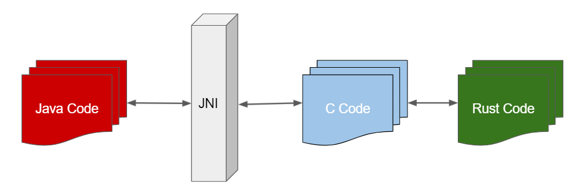

# 러스트로 안드로이드 라이브러리 만들기 (ELI5)

안드로이드 팀에서 기존 C/C++로 개발되던 안드로이드 OS 개발에 [Rust도 사용하기로 했다는 글](https://security.googleblog.com/2021/04/rust-in-android-platform.html)을 보며 안드로이드 앱 개발을 할 때 일부 라이브러리들을 Rust로 구현했던 경험을 정리합니다.

여기에서 예제로 사용된 셈플 코드는 깃헙에 있는 모질라 블로그에서 발췌한것이며 실제로 프로젝트에서 사용했던 코드와는 상이함을 명시합니다.


### 왜 러스트인가?

일단 안드로이드 앱개발자면 한번쯤은 본 시스템 아키텍처 다이어그램을 보겠습니다.


[*뭔가 기존에 본 다이어그램보다 산듯해진 느낌이 든다면 당신은 안드로이드 앱 개발을 오래전부터 시작하신 분일겁니다.*]


위의 다이어그램에서 보듯이 안드로이드의 최하층부는 리눅스커널이 위치해있으며 그 위에 하드웨어를 제어하는 드라이버들을 추상화한 계층인 HAL과 Linux의 `system call`을 할 수 있는 `Native C/C++ Libraries`, 그리고 JAVA byte code를 동작시키는 VM인 `Android Runtime (ART | Dalvik VM)`이 구성돼있는 것을 볼 수 있습니다.

안드로이드 앱을 개발한다는것은 대부분 최상층부에 있는 `Java API Framework`를 이용해서 앱을 만든는 것을 의미합니다.

그리고 일반적인 앱은 저것으로 충분히 만들 수 있습니다. 하지만 기기의 성능을 극한까지 뽑아야하는 작업(예를 들면 게임이라든지)인 경우 `ART`위에서 동작하는 앱 만으로는 구현이 어려울 수 있습니다.

안드로이드 팀도 이 점 때문에 Android SDK뿐 아니라 [NDK](https://developer.android.com/ndk)도 배포하고 있으며 여기서는 NDK가 다음과 같은 상황에서 유용할 수 있다고 기술돼있습니다.

- 기기의 성능을 최대한 활용하여 짧은 지연 시간을 구현해야 하거나 게임 또는 물리학 시뮬레이션과 같은 컴퓨팅 집약적 애플리케이션을 실행해야 하는 상황
- 본인 또는 다른 개발자의 C 또는 C++ 라이브러리를 재사용하는 경우


그렇다면 C/C++로 NDK를 이용하면 되는 것이지 왜 Rust? 이런 생각이 들 것입니다. 그 이유는 <strike>글쓴이의 취향</strike> C/C++사용하여 개발할 시 흔하게 발생하는 메모리 관련 실수들을 미리 방지해주면서 거의 동일한 수준의 성능을 보이고 게다가 FFI가 쉬운 언어가 바로 Rust이기 때문입니다. [여기](https://www.rust-lang.org/)에서 Rust의 장점<strike>과 지금 이 글을 읽고 있는 독자가 왜 지금 당장 Rust를 사용해야하는지에 대한 모든 내용</strike>이 소개돼있습니다.


### 준비사항

- Android  SDK & [NDK](https://developer.android.com/ndk)
- [Rustup](https://rustup.rs/)

우리는 안드로이드 용 앱과 라이브러리를 만들 것이기 때문에 당연하겠지만 안드로이드 SDK가 필요합니다. 그리고 Rust로 만든 라이브러리는 NDK를 사용하여 크로스 컴파일을 진행할 것이기 때문에 NDK역시 필요합니다.

안드로이드 SDK와 NDK는 [안드로이드 스튜디오](https://developer.android.com/studio#downloads)에  포함된 `sdkmanager`에서 다운로드 및 관리를 할 수 있으니 되도록 안드로이드 스튜디오를 사용하는 것을 추천합니다.

Rustup은 rust 컴파일러의 설치 및 버전 관리등 전반적인 toolchain installer입니다. 대표적으로 `rustc`의 버전관리와 stable-nightly의 toolchain 변경, 그리고 이 글에서 소개할 크로스 컴파일 시 필요한 target toolchain을 간편하게 설치할 수 있도록 도와줍니다.


### 안드로이드 아키텍처 종류

모바일 기기와 일반적인 PC의 CPU(모바일은 AP - Application Processor는 정확하게 PC와 1:1로 동일한 부품은 아닙니다. PC에서 CPU와  메인 보드에 붙어있는 Northbridge, Southbridge chip들을 합친 역할을 합니다.)는 아키텍처가 다릅니다.

주로 PC에서는 x86계열을 모바일에서는 arm계열을 사용하며 이 둘의 차이는 이 칩들이 사용하는 명령어들(instruction set)이 다른것이고 이는 다르게 표현하면 사용하는 기계어(어셈블리어)가 다르다는 것이고 그로 인해 C나 C++같은 언어를 컴파일할 때 각각 플랫폼에 맞도록 컴파일을 해야한다는 것입니다.

그렇다면 안드로이드는 어떤 아키텍처로 컴파일을 해야하는가하는 고민이 들 것입니다.

기본적으로 안드로이드는 Linux이기 때문에 Linux가 포팅될 수 있는 모든 플랫폼은 안드로이드가 포팅될 수 있습니다. 하지만 실질적으로 안드로이드가 포팅되서 사용되는 아키텍처는 크게 다음과 같습니다.

- arm 계열 AP (32bit / 64bit)
- x86 계열 CPU (32bit / 64bit)

arm 계열 AP는 PC를 제외한(하지만 애플의 맥북이 arm계열 CPU를 탑제함에 따라 일반 PC도 arm계열이 대중화 될 수도 있을지도 모릅니다) 모바일 폰, 시계 등에 사용됩니다. 그리고 x86계열은 PC에서 사용되는데 대표적으로 안드로이드 에뮬레이터를 실행했을 때 해당 에뮬레이터는 x86계열로 포팅된 안드로이드가 올라갑니다. 물론 arm 명령셋을 에뮬레이팅하는 에뮬레이터도 있지만 PC에서 해당 에뮬레이터를 실행시키면 매우 느리기 때문에(옛날에는 arm을 에뮬레이팅하는 에뮬레이터밖에 없어서 느린 속도로 악명이 높았습니다.) 일반적인 앱을 개발하고 확인할 때는 잘 사용하지 않습니다.


### Rust가 지원하는 플랫폼

안드로이드 아키텍처 종류를 알아봤으니 이제 rust가 지원할 수 있는지를 알아보도록 하겠습니다.

우선 rust가 지원하는 platform을 확인하기 위해서 아래와 같이 target list를 뽑아보면 상당히 많은 플랫폼을 지원하는것을 볼 수 있습니다.

```shell
$ rustc --print target-list | pr -tw100 --columns 3
aarch64-apple-darwin             i586-pc-windows-msvc             riscv64gc-unknown-none-elf
aarch64-apple-ios                i586-unknown-linux-gnu           riscv64imac-unknown-none-elf
aarch64-apple-ios-macabi         i586-unknown-linux-musl          s390x-unknown-linux-gnu
aarch64-apple-ios-sim            i686-apple-darwin                s390x-unknown-linux-musl
aarch64-apple-tvos               i686-linux-android               sparc-unknown-linux-gnu
aarch64-fuchsia                  i686-pc-windows-gnu              sparc64-unknown-linux-gnu
aarch64-linux-android            i686-pc-windows-msvc             sparc64-unknown-netbsd
aarch64-pc-windows-msvc          i686-unknown-freebsd             sparc64-unknown-openbsd
aarch64-unknown-freebsd          i686-unknown-haiku               sparcv9-sun-solaris
aarch64-unknown-hermit           i686-unknown-linux-gnu           thumbv4t-none-eabi
aarch64-unknown-linux-gnu        i686-unknown-linux-musl          thumbv6m-none-eabi
aarch64-unknown-linux-gnu_ilp32  i686-unknown-netbsd              thumbv7a-pc-windows-msvc
aarch64-unknown-linux-musl       i686-unknown-openbsd             thumbv7a-uwp-windows-msvc
aarch64-unknown-netbsd           i686-unknown-uefi                thumbv7em-none-eabi
aarch64-unknown-none             i686-uwp-windows-gnu             thumbv7em-none-eabihf
aarch64-unknown-none-softfloat   i686-uwp-windows-msvc            thumbv7m-none-eabi
aarch64-unknown-openbsd          i686-wrs-vxworks                 thumbv7neon-linux-androideabi
aarch64-unknown-redox            mips-unknown-linux-gnu           thumbv7neon-unknown-linux-gnueab
aarch64-uwp-windows-msvc         mips-unknown-linux-musl          thumbv7neon-unknown-linux-muslea
aarch64-wrs-vxworks              mips-unknown-linux-uclibc        thumbv8m.base-none-eabi
aarch64_be-unknown-linux-gnu     mips64-unknown-linux-gnuabi64    thumbv8m.main-none-eabi
aarch64_be-unknown-linux-gnu_ilp mips64-unknown-linux-muslabi64   thumbv8m.main-none-eabihf
arm-linux-androideabi            mips64el-unknown-linux-gnuabi64  wasm32-unknown-emscripten
arm-unknown-linux-gnueabi        mips64el-unknown-linux-muslabi64 wasm32-unknown-unknown
arm-unknown-linux-gnueabihf      mipsel-sony-psp                  wasm32-wasi
arm-unknown-linux-musleabi       mipsel-unknown-linux-gnu         wasm64-unknown-unknown
arm-unknown-linux-musleabihf     mipsel-unknown-linux-musl        x86_64-apple-darwin
armebv7r-none-eabi               mipsel-unknown-linux-uclibc      x86_64-apple-ios
armebv7r-none-eabihf             mipsel-unknown-none              x86_64-apple-ios-macabi
armv4t-unknown-linux-gnueabi     mipsisa32r6-unknown-linux-gnu    x86_64-apple-tvos
armv5te-unknown-linux-gnueabi    mipsisa32r6el-unknown-linux-gnu  x86_64-fortanix-unknown-sgx
armv5te-unknown-linux-musleabi   mipsisa64r6-unknown-linux-gnuabi x86_64-fuchsia
armv5te-unknown-linux-uclibceabi mipsisa64r6el-unknown-linux-gnua x86_64-linux-android
armv6-unknown-freebsd            msp430-none-elf                  x86_64-pc-solaris
armv6-unknown-netbsd-eabihf      nvptx64-nvidia-cuda              x86_64-pc-windows-gnu
armv7-apple-ios                  powerpc-unknown-linux-gnu        x86_64-pc-windows-msvc
armv7-linux-androideabi          powerpc-unknown-linux-gnuspe     x86_64-sun-solaris
armv7-unknown-freebsd            powerpc-unknown-linux-musl       x86_64-unknown-dragonfly
armv7-unknown-linux-gnueabi      powerpc-unknown-netbsd           x86_64-unknown-freebsd
armv7-unknown-linux-gnueabihf    powerpc-unknown-openbsd          x86_64-unknown-haiku
armv7-unknown-linux-musleabi     powerpc-wrs-vxworks              x86_64-unknown-hermit
armv7-unknown-linux-musleabihf   powerpc-wrs-vxworks-spe          x86_64-unknown-illumos
armv7-unknown-netbsd-eabihf      powerpc64-unknown-freebsd        x86_64-unknown-l4re-uclibc
armv7-wrs-vxworks-eabihf         powerpc64-unknown-linux-gnu      x86_64-unknown-linux-gnu
armv7a-none-eabi                 powerpc64-unknown-linux-musl     x86_64-unknown-linux-gnux32
armv7a-none-eabihf               powerpc64-wrs-vxworks            x86_64-unknown-linux-musl
armv7r-none-eabi                 powerpc64le-unknown-linux-gnu    x86_64-unknown-netbsd
armv7r-none-eabihf               powerpc64le-unknown-linux-musl   x86_64-unknown-none-hermitkernel
armv7s-apple-ios                 riscv32gc-unknown-linux-gnu      x86_64-unknown-none-linuxkernel
asmjs-unknown-emscripten         riscv32gc-unknown-linux-musl     x86_64-unknown-openbsd
avr-unknown-gnu-atmega328        riscv32i-unknown-none-elf        x86_64-unknown-redox
bpfeb-unknown-none               riscv32imac-unknown-none-elf     x86_64-unknown-uefi
bpfel-unknown-none               riscv32imc-unknown-none-elf      x86_64-uwp-windows-gnu
hexagon-unknown-linux-musl       riscv64gc-unknown-linux-gnu      x86_64-uwp-windows-msvc
i386-apple-ios                   riscv64gc-unknown-linux-musl     x86_64-wrs-vxworks
```

여기서 지원하는 플랫폼은 "target triple" 형태로 표시됩니다. <strike>triple이라고 써놓고 2~4가지 필드가 있는데다 생략조건도 일관성이 없는건 안 비밀</strike>

target triple은 architecture-vendor-system{-abi} 형태로 대상을 표현하는것을 의미하며 각기 다음과 같은 의미를 갖습니다.

- Architecture : 바이너리가 어떤 명령셋(instruction set) 위에서 돌아가야하는지를 나타냅니다. 안드로이드 아키텍처에 대해 살짝 알아봤을 때 우리가 관심이 있는 것은 arm계열과 x86계열일 것입니다.
- Vendor : 보통 디바이스의 제조사를 이야기하며 linux는 embedded linux까지 포함하여 대부분 unknown으로 표시됩니다.
- System : 대부분 많이 알고 있는 Operating System을 의미합니다. linux, windows, ios등이 해당됩니다.
- ABI : mac과 bsd에서는 복수의 ABI를 제공하지 않기때문에 생략될 때도 많고 "triple"에는 속하지 않지만 linux나 windows등에서는 compiler에 따라 라이브러리의 interface가 다르기 때문에 서로 호환이 안되고 이 때문에 명시해주는 것입니다. 안드로이드의 경우 androideabi(정확하게는 armeabi)같은 ARMv5/v6와 호환되지 않는 명령셋을 명시해주고 있습니다.


### 안드로이드 툴체인 설치

위에서 보면 알 수 있듯이 rust에서 지원가능한 android system은 다음과 같습니다. Vendor가 생략되어 있고 ABI가 표시돼있는것을 볼 수 있습니다.

`aarch64-linux-android`, `arm-linux-androideabi`, `armv7-linux-androideabi`, `i686-linux-android`, `x86_64-linux-android`

이제 위의 툴체인을 설치해봅시다

```shell
$ rustup target add aarch64-linux-android arm-linux-androideabi armv7-linux-androideabi i686-linux-android x86_64-linux-android
```


정상적으로 설치가 됐다면 installed targets for active toolchain에  표시가 될 것입니다.

```shell
$ rustup show
Default host: x86_64-unknown-linux-gnu
rustup home:  /home/username/.rustup

installed toolchains
--------------------

stable-x86_64-unknown-linux-gnu (default)

installed targets for active toolchain
--------------------------------------

aarch64-linux-android
arm-linux-androideabi
armv7-linux-androideabi
i686-linux-android
i686-pc-windows-msvc
x86_64-linux-android
x86_64-pc-windows-msvc
x86_64-unknown-linux-gnu

active toolchain
----------------

stable-x86_64-unknown-linux-gnu (default)
rustc 1.54.0 (a178d0322 2021-07-26)
```


### 안드로이드 NDK 설치

rust code를 크로스 컴파일하는 경우 최종 결과물을 얻기 위해서는 안드로이드 NDK에서 제공하는 ar(archiver)와 linker를 사용해야합니다. NDK의 버전이 r19이하라면 standalone tool을 따로 빌드해주는 script를 실행하여 사용해야했지만 최근 NDK는 더 이상 standalone 툴을 따로 만들어줄 필요가 없게 업데이트 됐습니다. 해당 내용은 [다음링크](https://developer.android.com/ndk/guides/standalone_toolchain)에서 확인할 수  있습니다.

`sdkmanager`로 NDK를 설치하면 설치 위치는 `{ANDROID_SDK_ROOT}/NDK/{NDK_VERSION}`됨을 확인할 수 있습니다. 물론 `sdkmanager`가 아니고 직접 다운로드 받아서 원하는 위치에 설치하는 것도 가능하며 여기서는 NDK_ROOT만 확실하게 알고 있으면 됩니다.


### Rust library 코드 작성

rust는 기본적으로 c와의 연동(FFI)가 매우 간편하게 돼있습니다. 여기서는 문자열을  반환하는 셈플 코드를 작성해보도록 하겠습니다.

우선 새로운 rust project를 생성합니다.

새로운 rust project는 `cargo`명령을 이용해서 매우 간단하게 생성할 수 있습니다.

```shell
$ cargo new rust_android
```


새로운 project를 생성했다면 아래 코드를 `src/lib.rs`에 작성합니다. 기본적으로 CLI 프로그램을 만들때의 엔트리포인트는 `main.rs`이지만 우리가 만드는 것은 실행파일 포멧이 아닌 library형태이기 때문에 `main.rs`는 사용하지 않습니다.

```rust
use std::ffi::{CStr, CString};
use std::os::raw::c_char;

#[no_mangle]
pub extern "C" fn rust_greeting(to: *const c_char) -> *mut c_char {
    let c_str = unsafe { CStr::from_ptr(to) };
    let recipient = match c_str.to_str() {
        Err(_) => "there",
        Ok(string) => string,
    };

    CString::new("Hello ".to_owned() + recipient)
        .unwrap()
        .into_raw()
}
```

위 코드가 일반적인 rust코드와 다른 점은 `#[no_mangle]`이라는 매크로, `extern "C"`구문, 그리고 `ffi::{CStr, CString}`사용등이 있는데 가장 먼저 보이는 `CStr, CString`은 일반적으로 rust는 문자열을 다룰 때 `str`의 reference인 `&str`와 `String`을 사용하는데 `CStr`과 `CString`은 c와의 연동을 위한 자료형으로 생각하면 됩니다. 보통 언어마다 문자열을 다루는 방법이 조금씩 다른데 `CStr, CString`의 경우 C에서 문자열을 다루듯이 null terminated array 형태로 문자를 다루고 있습니다.

`#[no_mangle]` 매크로의 경우 컴파일러마다 함수 이름을 변경하는 방식이 모두 다르므로 표준 C에 맞게 함수명 변경을 하지 않도록 하는 컴파일 옵션입니다. 이는 C++코드와 C를 연동할 때도 컴파일 시 변경하는 함수이름 때문에 상호 호출이 안되기 때문에 `extern "C"`를 사용합니다. rust에서는 `#[no_mangle]`매크로와 `extern "C"`를 모두 사용해서 해당 함수가 C와 연동 될 수 있게 작성해야합니다.


위 코드와 함께 `Cargo.toml`에 어떤 형식의 라이브러리를 빌드할지에 대한 정보도 제공해줘야합니다.

일단 우리는 정적 라이브러리와  동적 라이브러리 둘다 빌드를 할 것이기 때문에 Cargo.toml은 아래와 같은 형태로 구성될 것입니다.

```toml
[package]
name = "rust_android"
version = "0.1.0"
edition = "2018"

# See more keys and their definitions at https://doc.rust-lang.org/cargo/reference/manifest.html

[dependencies]

[lib]
name = "rust_android_lib"
crate-type = ["staticlib", "cdylib"]
```

여기서 눈여겨볼 만한 설정은 `[lib]`아래에 `crate-type`인데 `staticlib`과 `cdylib`로 설정했습니다. 이름에서도 유추할 수 있는것처럼 `staticlib`은 정적 라이브러리를 빌드하는 옵션이고 보통 `.a`확장자를 갖습니다. `cdylib`은 c에서 컴파일한것과 동일한(호환되는)형태의 동적 라이브러리를 빌드하는 옵션이고 POSIX계통이면 보통 `.so`, windows라면 `.dll`의 확장자를 갖습니다.


### build 해보기

이제 작성한 코드를 빌드를 해서 안드로이드용 정적 라이브러리 또는 동적 라이브러리를 얻어 볼 것입니다.

위에서 `Cargo.toml`설정까지 완료하고 build를 하면 지금 자신이 개발하고 있는 시스템을 target으로 빌드가 될 것입니다. 만약 Windows에서 빌드를 했다면 `librust_android_lib.a`와 `librust_android_lib.dll`, 리눅스나 맥북같은곳에서 빌드를 했다면 `librust_android_lib.so`같은 파일을 얻을 수 있을텐데 이 파일들은 개발환경에서 사용할 수 있지 안드로이드에서는 사용할 수 없습니다.

이제 위 코드를 안드로이드에서 사용할 수 있도록 target을 성정하여 빌드를 해보겠습니다.

러스트 코드를 빌드를 플랫폼별로 빌드를 할 때 NDK의 ar(archiver)와 linker를 사용한다고 했는데 이 설정은 `$PROJECT_ROOT/.cargo/config` 파일로 설정해줘야합니다.

```toml
[target.aarch64-linux-android]
ar = "$NDK_TOOL_ROOT/arm64/bin/aarch64-linux-android-ar"
linker = "$NDK_TOOL_ROOT/arm64/bin/aarch64-linux-android-clang"

[target.armv7-linux-androideabi]
ar = "$NDK_TOOL_ROOT/arm/bin/arm-linux-androideabi-ar"
linker = "$NDK_TOOL_ROOT/arm/bin/arm-linux-androideabi-clang"

[target.i686-linux-android]
ar = "$NDK_TOOL_ROOT/x86/bin/i686-linux-android-ar"
linker = "$NDK_TOOL_ROOT/x86/bin/i686-linux-android-clang"

[target.x86_64-linux-android]
ar = "$NDK_TOOL_ROOT/xx86_6486/bin/x86_64-linux-android-ar"
linker = "$NDK_TOOL_ROOT/x86_64/bin/x86_64-linux-android-clang"
```

애석하게도 config파일은 환경변수를 인식하지 못합니다.

셈플처럼 설정을 해주고 `$NDK_TOOL_ROOT`를 system 환경변수로 등록해줘도 저 코드는 동작하지 않을것입니다. 그러므로  시스템마다 `ar`과 `clang`의 절대 경로(full path)를 입력해줘야합니다.

만약 새로운 러스트 프로젝트를 생성하고 안드로이드 라이브러리를 만들 때마다 해당 설정을 하기가 번거롭다면 [build.rs](https://doc.rust-lang.org/cargo/reference/build-scripts.html)를 활용해 config파일을 build시에 생성해주는것도 고려할만 할 것입니다.


config를 마무리 했다면 다음 command로 라이브러리들을 각 플랫폼에 맞게 빌드합니다.

```shell
$ cargo build --target aarch64-linux-android --release
$ cargo build --target armv7-linux-androideabi --release
$ cargo build --target i686-linux-android --release
$ cargo build --target x86_64-linux-android --release
```

빌드가 성공했다면 `/target` 디렉토리에 각 플랫폼별 디렉토리가 생성돼있고 `librust_android_lib.a`와 `librust_android_lib.so`파일을 찾을 수 있을 것입니다.


### JNI로 구성하기

각 target별로 빌드해서 얻은 파일들은 C 라이브러리 입니다. 그런데 안드로이드 앱은 자바VM(정확하게는 ART) 위에서 동작합니다. 자바환경에서 C로 만든 라이브러리(Native binary)를 호출하려면 JNI(Java Native Interface)를 이용하여 bridge를 해야하는데 구조를 그림으로 보면 아래와 같습니다. (Native binary와 Java를 연동하는 기술은 JNI외에도 JNA같은 다른 기술도 있지만 안드로이드에서는 JNI를 공식적으로 지원합니다. 해당 내용은 [여기](https://developer.android.com/training/articles/perf-jni)를 참고할 수 있습니다.)



iOS와의 공용으로 사용하려면 C/C++ bridge와 JNI까지 모두 손수 작성할 수도 있겠지만 이 글에서는 안드로이드만 다룰것이기 때문에 [jni-rs](https://github.com/jni-rs/jni-rs) crate을 사용하기로 하겠습니다. (실제로 현업에서는 Rust - C 호환 라이브러리만 제공하고 bridge는 각 플랫폼마다 직접 작성하여 사용했지만 여기서는 안드로이드만 다룰 것이므로 C - JNI 작성하는 부분은 다루지 않겠습니다.)


`jni-rs`를 사용하기 위해 `Cargo.toml`에 아래 의존성(dependencies)을 추가합니다.

```toml
[target.'cfg(target_os="android")'.dependencies]
jni = { version = "0.19.0", default-features = false }
```

jni는 안드로이드의 연결에서만 사용할 것이므로(해당 라이브러리를 안드로이드 이외에 JVM이 돌아가는 시스템에 연결하고  싶다면 `target_os`부분을 추가하거나 제거해야 합니다.) `target_os`부분을 추가했습니다.

추가로 `crate-type`부분을 아래처럼 수정합니다.

```toml
crate-type = ["dylib"]
```

위에서 `staticlib`과 `cdylib`은 c bridge를 위한 library를 만들 때 사용하지만 이번에는 jni로 c bridge까지를 한꺼번에 묶은 형태의 라이브러리를 만들것입니다.


`Cargo.toml`의 설정이 완료됐다면 `src/lib.rs`에 아래 코드를 추가합니다. 아래 코드는 `jni-rs` crate을 이용하여 Java에서 호출 할 수 있는 함수를 만드는 코드입니다.

```rust
#[cfg(target_os="android")]
#[allow(non_snake_case)]
pub mod android {
    extern crate jni;

    use super::*;
    use self::jni::JNIEnv;
    use self::jni::objects::{JClass, JString};
    use self::jni::sys::{jstring};

    #[no_mangle]
    pub unsafe extern fn Java_com_getmiso_greetings_RustGreetings_greeting(env: JNIEnv, _: JClass, java_pattern: JString) -> jstring {
        // Our Java companion code might pass-in "world" as a string, hence the name.
        let world = rust_greeting(env.get_string(java_pattern).expect("invalid pattern string").as_ptr());
        // Retake pointer so that we can use it below and allow memory to be freed when it goes out of scope.
        let world_ptr = CString::from_raw(world);
        let output = env.new_string(world_ptr.to_str().unwrap()).expect("Couldn't create java string!");

        output.into_inner()
    }
}
```

첫번째 매크로는 `target_os`를 설정해주는것으로 다른 target들에서는 해당 코드는 빌드에 포함하지 않는다는 의미입니다.

두번째 줄에 사용된 `non_snake_case`허용에 대한 매크로가 없다면 코드를 컴파일 할 때 `Java_com_getmiso_greetings_RustGreetings_greeting`함수의 이름 때문에 warning이 나올것입니다. 이는 지금 작성해서 사용할 함수의 이름이 rust의 이름 규칙(naming convention)과 맞지 않은 이름이기 때문이며 문제는 저 이름이 JNI를 사용하기 위해서는 package명과 class, method name을 맞춰줘야하는 강제적 사항이기 때문에 매크로로 해당 이름을 허용하는 것입니다. Rust의 이름 규칙(name convention)에 대한 정리는 [이곳](https://doc.rust-lang.org/1.0.0/style/style/naming/README.html)에서 볼 수 있습니다.


JNI로 구성하는 함수의 이름은 다음의 규칙을 갖고 구성해야합니다.

1. 함수이름은 Java_로 시작합니다.
2. 클래스의 `package name`을 `.`을 `_`로 치환해서 이어줍니다.
3. java에서 method로 사용할 함수 이름을 지정합니다.

저 규칙에 따르면 `Java_com_getmiso_greetings_RustGreetings_greeting`은 `com.getmiso.greetings` package에 `RustGreetings`란 class에 `greeting`이란 method를 Native Call할 함수로 선정했다는 의미입니다. [JNI의 전체 명세](https://docs.oracle.com/javase/7/docs/technotes/guides/jni/spec/jniTOC.html)는 이곳에서 볼 수 있고 [이름 규칙](https://docs.oracle.com/javase/7/docs/technotes/guides/jni/spec/design.html#wp615)은 이곳에서 볼 수 있습니다.


이제 아까와같이 각 플랫폼별로 다시 컴파일을 하면 `so`파일을 얻을 수 있을 것입니다.

여기까지 했으면 rust로 만드는 라이브러리는 작업이 끝났습니다.

다음은 이 라이브러리를 안드로이드앱에서 사용하는 방법에 대해 알아보도록 하겠습니다.


### 안드로이드 앱에서 라이브러리 사용하기

안드로이드 앱을 만들기 위해서 [안드로이드 스튜디오](https://developer.android.com/studio/install?hl=ko)를 실행해서 새로운 프로젝트를 생성합니다. 여기서는 Greentings라는 앱을 만들것입니다.

Empty Activity 탬플릿으로 새로운 안드로이드 앱을 생성하려면 package name을 지정해줘야하는데 위에서 JNI 함수에서 지정한 package명 (`com.getmiso.greetings`)로 지정합니다. 만약 이 package명이 다르다면 경로에 함수를 찾지 못하고 앱을 runtime error가 발생하며 앱이 종료될 것입니다.

안드로이드 프로젝트를 생성해다면 `com.getmiso.greetings.MainActivity`가 엔트리 포인트로 지정된것을 `AndroidManifest.xml`에서 확인할 수 있을것입니다. 이제 JNI와 연결된 java code를 써봅시다.

```java
package com.getmiso.greetings;

public class RustGreetings {
    private static native String greeting(final String pattern);

    public String sayHello(String to) {
        return greeting(to);
    }
}
```

위 코드를 `app/src/main/java/com/getmiso/greetings/RustGreetings.java`에 생성해줍니다. 여기서 `greeting` method가 JNI로 연결되서 실제 native call을 하는 method입니다.

이제 위의 method를 실제로 호출해보기 전에 한가지 해야할 것이 있습니다.

그것은 동적 라이브러리들을 안드로이드 프로젝트에 포함시키는 작업입니다.

빌드가 완료된 `so`파일들을 `/app/src/main/jniLibs`에 각 플랫폼마다 폴더를 만들고 복사해줍니다.

각 플랫폼은 [Android ABI](https://developer.android.com/ndk/guides/abis)를 참고합니다. 이에 대한 설명은 [여기](https://developer.android.com/studio/projects/gradle-external-native-builds#jniLibs)를 참고합니다.

처음 보면 약간 혼란스러운 점이 `jniLibs`폴더에서 사용하는 아키텍처 이름과 rust에서 사용한 아키텍처 이름이 약간씩 다른데 아래의 파일 트리와 같이 구성하면 됩니다.

```
/app/src/main/jniLibs
	./arm64-v8a        <- aarch64-linux-android
	./armeabi-v7a      <- armv7-linux-androideabi
	./x86              <- i686-linux-android
	./x86_64           <- x86_64-linux-android
```


라이브러리까지 잘 포함했다면 이제 라이브러리를 앱을 실행하면 바로 볼 수 있도록 `MainActivity`에서 호출해볼 것입니다. `app/src/main/java/com/getmiso/greetings/MainActivity.java`를 아래처럼 구성합니다.

```java
package com.getmiso.greetings;

import androidx.appcompat.app.AppCompatActivity;

import android.os.Bundle;
import android.widget.TextView;

public class MainActivity extends AppCompatActivity {
    static {
        System.loadLibrary("rust_android_lib");
    }

    @Override
    protected void onCreate(Bundle savedInstanceState) {
        super.onCreate(savedInstanceState);
        setContentView(R.layout.activity_main);

        RustGreetings g = new RustGreetings();
        String r = g.sayHello("world");
        ((TextView)findViewById(R.id.greetingField)).setText(r);
    }
}
```

우선 라이브러리를 사용하려면 `System.loadLibrary`를 이용해서 로드해야합니다. 여기서 파일 이름의 접두사(prefix) lib를 제거한 파일 이름을 적어줍니다. 이 이름이 틀리면 네이티브 라이브러리를 로드할 수 없다는 에러가 발생하기 때문에 정확하게 입력해야합니다.

그리고 실제 native method인 `greeting`을 사용한 `sayHello` method를 사용해 문자열을 조작하여 `r`에  할당한걸 볼 수 있습니다.

위 코드는 activity_main.xml에 TextView에 해당 문자열을 출력하도록 코드가 구성돼있지만 `r`을 Logcat으로 출력해보면 "Hello world"라는 문자열이 표시되는것을 볼 수 있을 것입니다.


이렇게 러스트로 안드로이드 라이브러리 만드는 방법에 대해 간략하게 알아보았습니다.

글을 쓰다가 너무 길어져서 생략한 내용이 많아 잘 전달이 될 수 있을까 걱정이 좀 되지만 아래 참고자료들을 보면 많은 의문이 해소될것입니다.


**Reference**

https://security.googleblog.com/2021/04/rust-in-android-platform.html

https://github.com/japaric/rust-cross

https://mozilla.github.io/firefox-browser-architecture/experiments/2017-09-21-rust-on-android.html

https://developer.android.com/ndk/downloads

https://developer.android.com/ndk/guides/standalone_toolchain

https://doc.rust-lang.org/cargo/reference/build-scripts.html

https://github.com/jni-rs/jni-rs

https://doc.rust-lang.org/1.0.0/style/style/naming/README.html

https://developer.android.com/training/articles/perf-jni

https://developer.android.com/studio/install?hl=ko

https://developer.android.com/ndk/guides/abis

https://developer.android.com/studio/projects/gradle-external-native-builds#jniLibs

https://developer.android.com/guide/platform

https://developer.android.com/ndk

https://developer.android.com/ndk/guides

https://rustup.rs/

https://medium.com/swlh/introduction-to-java-native-interface-establishing-a-bridge-between-java-and-c-c-1cc16d95426a

https://developer.android.com/training/articles/perf-jni
